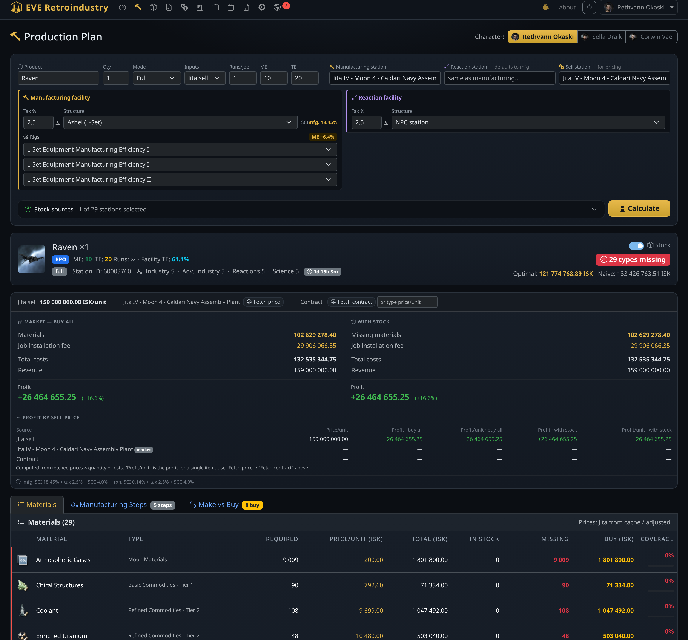
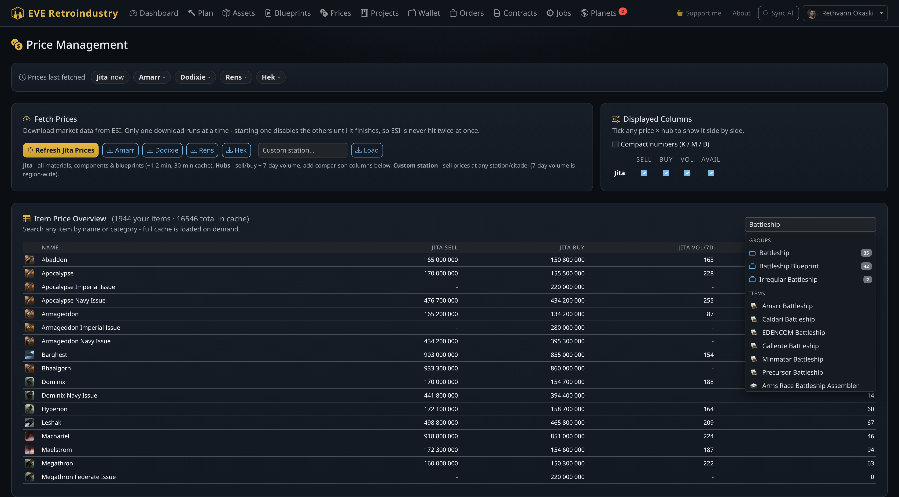
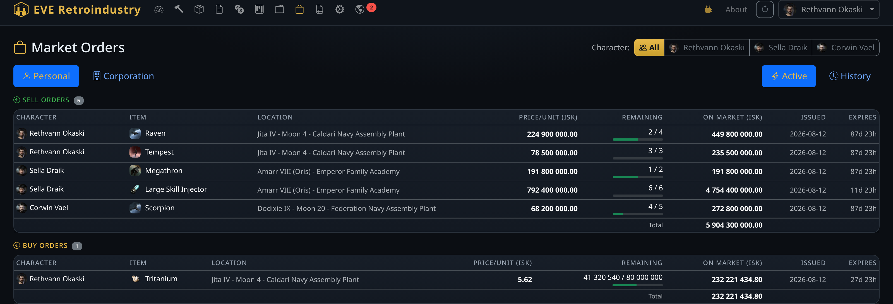
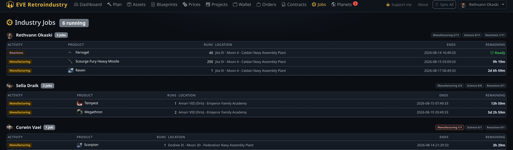
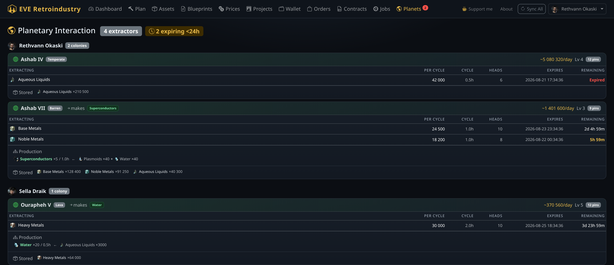
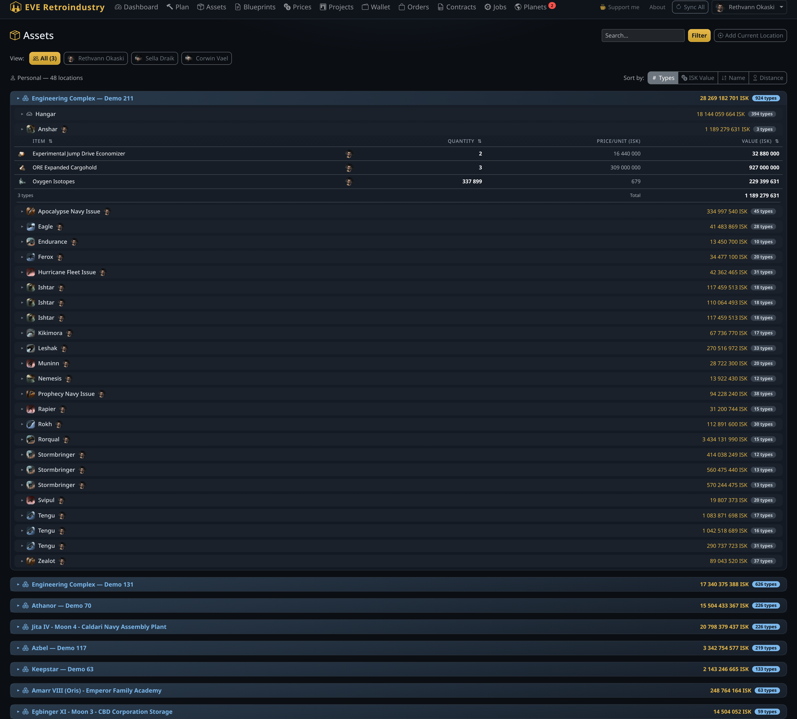

# EVE Retroindustry

A local industry calculator for EVE Online. Runs as a web app on your machine — blueprint cost analysis, bill of materials expansion, Jita market pricing, asset tracking, contract browsing, planetary interaction timers, and production project management. Multi-character support: load all your alts and switch between them per page.

> **Note on the project.** I build this primarily for my own EVE career — features land when I need them, and priorities follow whatever I'm doing in-game. It's shared publicly as-is: if you find it useful, you're welcome to use it. There's no support commitment or roadmap promise, but bug reports and ideas are welcome via [Issues](https://github.com/ScoopEMPRetro/Eve-retroindustry/issues).

**[⬇ Downloads and screenshots → everetroindustry.github.io](https://everetroindustry.github.io)**


---

## Features

- **Multi-character Dashboard** — log in any number of alts via EVE SSO; see all characters at a glance with portrait, corporation, current docked location, the skill in training with a live countdown, asset count, and estimated net worth. A **Total available cash** tile sums wallet ISK across every character
- **Production Planner** — enter any ship or component, pick a station, get a full bill of materials with Jita buy/sell prices, your asset coverage, manufacturing job time and fees (EIV × SCI × facility tax × SCC), profit vs. market and vs. stock, and the cheapest make-vs-buy decomposition. Inputs can be priced at **Jita sell** (instant-buy) or **Jita buy** (buy orders, how manufacturers actually source), and the **make-vs-buy optimiser weighs job install fees** — so it only builds a component when building genuinely wins
- **Blueprint Library** — full character (and alt) blueprint list with ME/TE levels, BPO vs BPC, runs remaining, organised by station and container
- **Asset Tracking** — character + corporation inventory grouped by location and container (incl. all corp hangar divisions), with estimated ISK value per stack and per station



- **Jita Price Cache** — fetches live market data from ESI, caches locally, refresh on demand; secondary trade hubs (Amarr / Dodixie / Rens / Hek) and any custom station/citadel can be pulled in for side-by-side price comparison. Click any item for a **price-history chart** and the **live regional order book**, as you'd see it in-game



- **Structure & Rig Modelling** — supports Raitaru / Azbel / Sotiyo / Athanor / Tatara with per-slot rig selection; ME/TE bonuses applied correctly with security multiplier (highsec 1.0× / lowsec 1.9× / null 2.1×)
- **Production Projects** — save a plan as a project, track which jobs are done, and get a unified shopping list across multi-stage manufacturing
- **Market Orders** — open buy/sell orders for every character and corporation, split into active vs. completed/expired. Active orders show the ISK **still on the market** (unsold units × price) with a per-section total, an in-game style **days/hours expiry countdown**, and clicking an item opens the order book with **your own order highlighted** so you can see where you sit among the competition



- **Industry Jobs** — running and finished manufacturing/reaction jobs, with per-character slot usage (used / available, derived from skills)



- **Planetary Interaction** — every character's colonies in one place, à la RIFT: extractor programs with a **live countdown to expiry** (red when expired, amber under 24 h, sorted soonest-first), what each head is pulling, the colony's **factory production chains** (output ← inputs, straight from the SDE), stored contents, and an estimated output value per day. A dashboard tile and a nav badge warn you when extractors are about to run dry



- **Contracts** — browse your own **personal + corporation** contracts, plus a **public contract browser**: index a whole region once, then search it locally by item, type, or price (ESI exposes no contract search, so the region is fully indexed into a local cache). Public contract prices can be pulled straight into the Production Planner for a side-by-side profit comparison against market prices
- **Wallet** — personal and corporation wallet balances
- **In-app updates** — check for new releases and apply them without leaving the app
- **System tray** — runs in the system tray; right-click for **Open App** and **Quit**



---

## Installation

### Windows

Two Windows downloads in every [**release**](https://github.com/ScoopEMPRetro/Eve-retroindustry/releases/latest):

| Asset | What it is |
|---|---|
| `…-win64-setup.zip` | **Installer.** Extract it and run the `setup.exe` inside |
| `…-win64-portable.zip` | **Portable.** Extract anywhere and run `EVE_Retroindustry.exe` |

The installer sets the app up **per user** (into `%LOCALAPPDATA%\Programs`), so there's **no admin prompt**, it adds Start Menu (and optionally desktop) shortcuts, and it appears in *Apps & features* with a proper uninstaller. Re-running a newer installer upgrades in place; in-app updates keep working too. Uninstalling leaves your characters, prices and projects alone — they live outside the install directory.

**Requires Windows 10 (1809) or newer** — the bundled Qt/Chromium runtime doesn't support Windows 7/8.1. The installer checks this and tells you rather than failing at launch.

### Linux

1. Download the latest release from [**Releases**](https://github.com/ScoopEMPRetro/Eve-retroindustry/releases/latest)
2. Extract the `-linux-portable.zip` anywhere, or use the single-file `.AppImage`
3. Run `EVE_Retroindustry`

### First run (both platforms)

1. On first launch the app downloads ~5 MB of game data automatically
2. Open the system tray icon → **Open App**, then click **Log In** in the top right and authenticate with your EVE character. Add more alts by clicking **+ Add Character** in the character dropdown.

No Python and no dependencies to install.

> **Note:** the app is unsigned, so Windows SmartScreen may warn you the first time you run it — click *More info → Run anyway*. Nothing hides this short of a code-signing certificate, which isn't practical for a hobby project; the releases publish SHA256 checksums so you can verify what you downloaded.

### Android (experimental)

An `EveRetroindustry.apk` is published with each release. It runs the full app on-device (a bundled Python server behind a native WebView). It's **arm64 only** and must be sideloaded:

1. Download `EveRetroindustry.apk` from the [latest release](https://github.com/ScoopEMPRetro/Eve-retroindustry/releases/latest)
2. Allow installation from unknown sources and install it manually
3. Later updates can be applied from inside the app (**About → Check for updates**)

This build is experimental — treat it as a work in progress rather than a polished release.

---

## Development Setup

Requires Python 3.11+.

```bash
git clone https://github.com/ScoopEMPRetro/Eve-retroindustry.git
cd Eve-retroindustry
python -m venv .venv && source .venv/bin/activate   # Windows: .venv\Scripts\activate
pip install -r requirements.txt
```

Import the Static Data Export (SDE) into the local database:

```bash
python import_sde.py
```

Run the dev server:

```bash
uvicorn app.web.main:app --reload --port 8000
```

Open [http://localhost:8000](http://localhost:8000).

---

## Building a Release

Releases are built automatically by GitHub Actions when a version tag is pushed:

```bash
git tag v0.x.y && git push origin v0.x.y
```

The workflow builds Windows, Linux and Android binaries and creates a GitHub Release with:

- `EVE_Retroindustry-vX.Y.Z-win64-setup.zip` (Windows installer, per-user)
- `EVE_Retroindustry-vX.Y.Z-win64-portable.zip` (Windows portable)
- `EVE_Retroindustry-vX.Y.Z-linux-portable.zip` + `EVE_Retroindustry-vX.Y.Z-linux.AppImage`
- `EveRetroindustry.apk` (Android, arm64 sideload)
- `sde_base.db` (game data, downloaded by the app on first run)
- `version.json` (used by the in-app updater)

The Android `versionCode` is derived from the tag (e.g. `v0.8.33` → `833`), and the APK is signed with a release key stored in GitHub Secrets — so releases can be cut from any machine.

To build locally:

```bash
python scripts/build_sde_base.py
pyinstaller eve_retroindustry.spec --noconfirm
```

---

## Tech Stack

| Layer | Library |
|---|---|
| Web framework | FastAPI + Uvicorn |
| Templates | Jinja2 + Bootstrap 5 (dark) |
| Database | SQLite via sqlite3 |
| EVE API | ESI (esi.evetech.net) |
| HTTP client | httpx (async) |
| Tray icon | pystray + Pillow |
| Desktop shell | pywebview (PyQt6 / QtWebEngine) |
| Packaging | PyInstaller (onedir) |
| Android | Chaquopy (on-device CPython) + native WebView |

---

## Data & Privacy

All data is stored locally on your machine in:

| File | Contents |
|---|---|
| `eve_cache.db` | Blueprints, assets, prices, projects, OAuth tokens for all characters |
| `.eve_config.json` | EVE SSO client ID only |
| `eve_retroindustry.log` | Application log (frozen builds only) |
| `icon_cache/` | Item icons, portraits and logos, downloaded once from the EVE image server |

Nothing is sent to any third-party server other than the official EVE Online ESI API (`esi.evetech.net`) and the EVE SSO login server (`login.eveonline.com`).

Static data is fetched once and kept locally — item icons and portraits, station/planet names, jump distances, and market history (revalidated with ETags, so unchanged data costs no download). Bootstrap and its icon font are bundled, not loaded from a CDN, so the interface renders without a network connection.

---

## Support

I develop this in my spare time, primarily for my own EVE career, and share it publicly as-is. If it saves you ISK or time and you'd like to support continued development, you can buy me a coffee — entirely optional, and much appreciated:

[](https://ko-fi.com/retrovisor)

---

## Legal

EVE Online and the EVE logo are the registered trademarks of CCP hf. All rights are reserved worldwide. This application is not endorsed by or affiliated with CCP hf.

Market data and character information are fetched from the [EVE Swagger Interface (ESI)](https://esi.evetech.net) under CCP's developer license.

---

## License

MIT — see [LICENSE](LICENSE)
